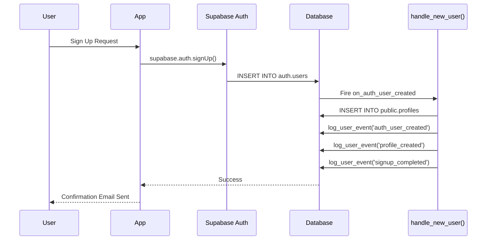

# Supabase Auth Audit & Profile Management Integration Guide

## 📋 Table of Contents

1. [Overview](#overview)
2. [Problem Statement](#problem-statement)
3. [Solution Architecture](#solution-architecture)
4. [Database Setup](#database-setup)
5. [Application Integration](#application-integration)
6. [Monitoring & Alerting](#monitoring--alerting)
7. [Troubleshooting](#troubleshooting)
8. [Production Checklist](#production-checklist)

---

## Overview

This guide provides a complete solution for:
- ✅ Correlating Supabase `auth.audit_log_entries` with `auth.users` and `public.profiles`
- ✅ Understanding and handling blocked signup attempts (`[blocked]` suffix)
- ✅ Implementing reliable application-level event logging
- ✅ Setting up production monitoring and alerts
- ✅ Ensuring consistent user ↔ profile mapping

### Key Files

```
backend/supabase/
  ├── auth_audit_comprehensive_guide.sql     # All SQL queries
  ├── auth_audit_monitoring_dashboard.sql    # Monitoring queries
  └── auth_audit_api_examples.sql            # Edge function examples

docs/supabase/
  ├── AUTH_AUDIT_INTEGRATION_GUIDE.md        # This file
  └── AUTH_AUDIT_BLOCKED_SIGNUPS.md          # Blocked signups explanation
```

---

## Problem Statement

### The Challenge

When attempting to correlate Supabase audit log entries with users and profiles, we discovered:

**❌ What Doesn't Work:**
```sql
-- These fields are NULL for signup events
payload->'traits'->>'user_id'     -- NULL
payload->'traits'->>'user_email'  -- NULL
```

**✅ What Actually Works:**
```sql
-- These fields contain the actual data
payload->>'actor_id'              -- Contains auth user UUID
payload->>'actor_username'        -- Contains email (sometimes with "[blocked]")
```

### Key Issues Discovered

1. **Missing Traits**: `traits.user_id` and `traits.user_email` are NULL in signup audit entries
2. **Blocked Signups**: Many entries show `actor_username` like `"user@email.com [blocked]"`
3. **Missing Profiles**: Some users in `auth.users` don't have corresponding `public.profiles`
4. **Unreliable Audit Logs**: Can't depend on audit logs alone for user tracking

---

## Solution Architecture

### Three-Tier Tracking System

```
┌─────────────────────────────────────────────────────────────────┐
│                    auth.audit_log_entries                       │
│  Use for: Security auditing, blocked attempts, abuse detection  │
│  NOT for: Primary user tracking, business metrics               │
└─────────────────────────────────────────────────────────────────┘
                              ↓
┌─────────────────────────────────────────────────────────────────┐
│                         auth.users                              │
│  Managed by: Supabase Auth                                      │
│  Trigger: on_auth_user_created → public.handle_new_user()      │
└─────────────────────────────────────────────────────────────────┘
                              ↓
┌─────────────────────────────────────────────────────────────────┐
│                      public.profiles                            │
│  Auto-created: By trigger on auth.users INSERT                 │
│  Constraint: FK to auth.users ON DELETE CASCADE                 │
└─────────────────────────────────────────────────────────────────┘
                              ↓
┌─────────────────────────────────────────────────────────────────┐
│                     public.user_events                          │
│  Source of Truth: Application-controlled event logging         │
│  Events: signup_completed, profile_created, login_success       │
└─────────────────────────────────────────────────────────────────┘
```

### Event Flow



---

## Database Setup

### 1. Verify Migrations Are Applied

All necessary migrations should already be applied. Verify with:

```sql
-- Check if migrations have been applied
SELECT version, name, executed_at
FROM _supabase_migrations
WHERE version IN (
  '20251124110000',  -- signup_profile_reliability
  '20251124120000',  -- audit_correlation_comprehensive_fix
  '20251126120000'   -- signup_event_observability
)
ORDER BY version;
```

### 2. Verify Tables Exist

```sql
-- Check user_events table
SELECT column_name, data_type, is_nullable
FROM information_schema.columns
WHERE table_schema = 'public'
  AND table_name = 'user_events'
ORDER BY ordinal_position;

-- Expected columns:
-- id (bigserial), user_id (uuid), event_type (text), 
-- email (text), metadata (jsonb), created_at (timestamptz)
```

### 3. Verify Trigger is Active

```sql
-- Check handle_new_user trigger
SELECT 
  trigger_name,
  event_manipulation,
  action_statement,
  action_timing
FROM information_schema.triggers
WHERE event_object_schema = 'auth'
  AND event_object_table = 'users'
  AND trigger_name = 'on_auth_user_created';

-- Should return: on_auth_user_created, INSERT, 
-- EXECUTE FUNCTION public.handle_new_user(), AFTER
```

### 4. Run Backfill for Missing Profiles

```sql
-- Backfill any users missing profiles
SELECT * FROM public.backfill_missing_profiles();

-- Verify no users are missing profiles
SELECT COUNT(*) AS users_without_profiles
FROM auth.users u
LEFT JOIN public.profiles p ON p.id = u.id
WHERE p.id IS NULL;
-- Should return 0
```

---

## Application Integration

### Frontend: Signup Flow

**TypeScript/React Example:**

```typescript
import { supabase } from '@/lib/supabaseClient';

interface SignupData {
  email: string;
  password: string;
  firstName: string;
  lastName: string;
  accountType: 'SME' | 'Professional' | 'Investor' | 'Donor' | 'Government';
}

export async function handleSignup(data: SignupData) {
  try {
    // 1. Sign up with Supabase Auth
    const { data: authData, error: authError } = await supabase.auth.signUp({
      email: data.email,
      password: data.password,
      options: {
        data: {
          first_name: data.firstName,
          last_name: data.lastName,
          account_type: data.accountType,
          full_name: `${data.firstName} ${data.lastName}`.trim(),
        },
      },
    });

    if (authError) {
      // Check if it's a rate limit error (blocked signup)
      if (authError.message.includes('too many') || 
          authError.message.includes('rate limit')) {
        throw new Error(
          'Too many signup attempts. Please try again in a few minutes.'
        );
      }
      throw authError;
    }

    if (!authData.user) {
      throw new Error('Signup succeeded but no user returned');
    }

    // 2. Profile should be auto-created by trigger
    // Wait a moment and verify
    await new Promise(resolve => setTimeout(resolve, 500));

    // 3. Verify profile exists
    const { data: profile, error: profileError } = await supabase
      .from('profiles')
      .select('id, email, account_type')
      .eq('id', authData.user.id)
      .single();

    if (profileError || !profile) {
      console.error('Profile not auto-created:', profileError);
      
      // Log this for monitoring
      await logSignupIssue(authData.user.id, 'profile_missing');
      
      // Optionally retry profile creation
      // This shouldn't normally be needed if trigger is working
    }

    // 4. Optionally log custom application event
    await logUserEvent(authData.user.id, 'signup_initiated', {
      source: 'web',
      account_type: data.accountType,
    });

    return {
      success: true,
      user: authData.user,
      profile,
    };

  } catch (error: any) {
    console.error('Signup error:', error);
    
    // Handle specific error types
    if (error.message.includes('already registered')) {
      throw new Error('This email is already registered. Try signing in instead.');
    }
    
    if (error.message.includes('too many')) {
      throw new Error('Too many signup attempts. Please try again in a few minutes.');
    }
    
    throw error;
  }
}

// Helper: Log custom user event
async function logUserEvent(
  userId: string,
  eventType: string,
  metadata: Record<string, any> = {}
) {
  try {
    const { error } = await supabase
      .from('user_events')
      .insert({
        user_id: userId,
        event_type: eventType,
        email: metadata.email || '',
        metadata: metadata,
      });

    if (error) {
      console.error('Failed to log user event:', error);
    }
  } catch (err) {
    console.error('Error logging user event:', err);
  }
}

// Helper: Log signup issue for monitoring
async function logSignupIssue(userId: string, issue: string) {
  try {
    const { error } = await supabase
      .from('user_events')
      .insert({
        user_id: userId,
        event_type: 'signup_issue',
        email: '',
        metadata: { issue },
      });

    if (error) {
      console.error('Failed to log signup issue:', error);
    }
  } catch (err) {
    console.error('Error logging signup issue:', err);
  }
}
```

### Backend: Edge Function Example

**Supabase Edge Function (Deno/TypeScript):**

```typescript
import { createClient } from 'https://esm.sh/@supabase/supabase-js@2';

interface SignupWebhookPayload {
  type: 'INSERT';
  table: 'users';
  schema: 'auth';
  record: {
    id: string;
    email: string;
    created_at: string;
    raw_user_meta_data: Record<string, any>;
  };
}

Deno.serve(async (req) => {
  try {
    const payload: SignupWebhookPayload = await req.json();

    // Only process INSERT events on auth.users
    if (payload.type !== 'INSERT' || payload.table !== 'users') {
      return new Response('Ignored', { status: 200 });
    }

    const supabaseAdmin = createClient(
      Deno.env.get('SUPABASE_URL') ?? '',
      Deno.env.get('SUPABASE_SERVICE_ROLE_KEY') ?? ''
    );

    const userId = payload.record.id;
    const userEmail = payload.record.email;

    // 1. Verify profile was created by trigger
    const { data: profile, error: profileError } = await supabaseAdmin
      .from('profiles')
      .select('id')
      .eq('id', userId)
      .single();

    if (profileError || !profile) {
      console.error('Profile missing for user:', userId);

      // Log error event
      await supabaseAdmin.rpc('log_user_event', {
        p_user_id: userId,
        p_event_type: 'profile_verification_failed',
        p_email: userEmail,
        p_metadata: {
          error: profileError?.message || 'Profile not found',
          source: 'webhook',
        },
      });

      // Optionally send alert
      await sendAlert(`Profile missing for user ${userId} (${userEmail})`);
    }

    // 2. Log custom application event
    await supabaseAdmin.rpc('log_user_event', {
      p_user_id: userId,
      p_event_type: 'signup_webhook_processed',
      p_email: userEmail,
      p_metadata: {
        source: 'edge_function',
        account_type: payload.record.raw_user_meta_data?.account_type,
      },
    });

    // 3. Additional business logic (e.g., send welcome email)
    // ...

    return new Response(JSON.stringify({ success: true }), {
      headers: { 'Content-Type': 'application/json' },
      status: 200,
    });

  } catch (error) {
    console.error('Error processing signup webhook:', error);
    return new Response(JSON.stringify({ error: error.message }), {
      headers: { 'Content-Type': 'application/json' },
      status: 500,
    });
  }
});

async function sendAlert(message: string) {
  // Implement your alerting logic (e.g., Slack, PagerDuty, email)
  console.error('ALERT:', message);
}
```

### Using the log_user_event Function

**Direct SQL Call:**

```sql
-- Log a custom event from SQL
SELECT public.log_user_event(
  'user-uuid-here'::uuid,
  'custom_event_type',
  'user@example.com',
  jsonb_build_object(
    'key1', 'value1',
    'key2', 'value2'
  )
);
```

**From Application Code:**

```typescript
// Using Supabase RPC
const { data, error } = await supabase.rpc('log_user_event', {
  p_user_id: userId,
  p_event_type: 'profile_completed',
  p_email: userEmail,
  p_metadata: {
    completed_sections: ['basic_info', 'contact', 'preferences'],
    completion_percentage: 100,
  },
});
```

---

## Monitoring & Alerting

### 1. Real-Time Health Check Dashboard

**Query for Dashboard:**

```sql
-- Comprehensive signup health metrics
SELECT * FROM public.get_signup_statistics(24);  -- Last 24 hours
```

**Expected Output:**
```
period_hours | total_auth_users | total_profiles | users_without_profiles | ...
-------------|------------------|----------------|------------------------|----
24           | 150              | 150            | 0                      | ...
```

### 2. Alert Queries

**Alert #1: Missing Profiles (Critical)**

```sql
-- Run every 5 minutes
-- Alert if any user is missing profile for >2 minutes
SELECT
  u.id,
  u.email,
  u.created_at,
  EXTRACT(EPOCH FROM (NOW() - u.created_at)) / 60 AS minutes_ago
FROM auth.users u
LEFT JOIN public.profiles p ON p.id = u.id
WHERE p.id IS NULL
  AND u.created_at > NOW() - INTERVAL '10 minutes'
  AND u.created_at < NOW() - INTERVAL '2 minutes';  -- Grace period

-- If returns >0 rows: CRITICAL ALERT
```

**Alert #2: Profile Creation Errors (Critical)**

```sql
-- Run every 5 minutes
SELECT COUNT(*) AS error_count
FROM public.user_events
WHERE event_type IN ('profile_creation_error', 'profile_creation_failed')
  AND created_at > NOW() - INTERVAL '5 minutes';

-- If error_count > 0: CRITICAL ALERT
```

**Alert #3: Excessive Blocked Attempts (Warning)**

```sql
-- Run every hour
-- Alert if single email has >10 blocked attempts in last hour
SELECT
  regexp_replace(payload->>'actor_username', ' \\[blocked\\]$', '') AS email,
  COUNT(*) AS attempts
FROM auth.audit_log_entries
WHERE payload->>'actor_username' LIKE '%[blocked]%'
  AND created_at > NOW() - INTERVAL '1 hour'
GROUP BY email
HAVING COUNT(*) > 10
ORDER BY attempts DESC;

-- If returns >0 rows: WARNING (possible abuse)
```

**Alert #4: Missing Signup Events (Warning)**

```sql
-- Run every 15 minutes
-- Alert if new users don't have signup_completed event
SELECT COUNT(*) AS missing_events
FROM auth.users u
JOIN public.profiles p ON p.id = u.id
LEFT JOIN public.user_events e 
  ON e.user_id = u.id 
  AND e.event_type = 'signup_completed'
WHERE e.id IS NULL
  AND u.created_at > NOW() - INTERVAL '15 minutes'
  AND u.created_at < NOW() - INTERVAL '2 minutes';  -- Grace period

-- If missing_events > 5: WARNING (event logging may be broken)
```

### 3. Monitoring Views

**Use built-in views for quick checks:**

```sql
-- View: Users without profiles
SELECT * FROM public.v_users_without_profiles
ORDER BY minutes_since_signup DESC;

-- View: Signup correlation status
SELECT * FROM public.v_signup_correlation_status
WHERE correlation_status != 'healthy'
LIMIT 50;

-- View: Recent signup events
SELECT * FROM public.v_recent_signup_events
LIMIT 100;
```

---

## Troubleshooting

### Issue: Users Missing Profiles

**Symptoms:**
- Users can sign up but profile is not created
- `v_users_without_profiles` shows entries

**Diagnosis:**

```sql
-- 1. Check if trigger exists and is active
SELECT * FROM information_schema.triggers
WHERE event_object_table = 'users'
  AND event_object_schema = 'auth'
  AND trigger_name = 'on_auth_user_created';

-- 2. Check for profile creation errors
SELECT *
FROM public.user_events
WHERE event_type IN ('profile_creation_error', 'profile_creation_failed')
ORDER BY created_at DESC
LIMIT 10;

-- 3. Check RLS policies on profiles
SELECT * FROM pg_policies
WHERE schemaname = 'public'
  AND tablename = 'profiles';
```

**Solutions:**

1. **If trigger is missing:**
   ```sql
   -- Recreate trigger
   DROP TRIGGER IF EXISTS on_auth_user_created ON auth.users;
   CREATE TRIGGER on_auth_user_created
     AFTER INSERT ON auth.users
     FOR EACH ROW
     EXECUTE FUNCTION public.handle_new_user();
   ```

2. **If RLS is blocking:**
   ```sql
   -- Verify service role policy exists
   CREATE POLICY IF NOT EXISTS "Profiles managed by service role"
     ON public.profiles
     FOR ALL TO service_role
     USING (true)
     WITH CHECK (true);
   ```

3. **Run backfill:**
   ```sql
   SELECT * FROM public.backfill_missing_profiles();
   ```

### Issue: Blocked Signups

**Symptoms:**
- Users report "can't sign up"
- Audit logs show `[blocked]` suffix

**Diagnosis:**

```sql
-- Check blocked attempts for specific email
SELECT
  payload->>'actor_username' AS email,
  payload->>'action' AS action,
  created_at
FROM auth.audit_log_entries
WHERE payload->>'actor_username' LIKE '%user@example.com%'
  AND payload->>'actor_username' LIKE '%[blocked]%'
ORDER BY created_at DESC;
```

**Solutions:**

1. **User Education:**
   - Explain to user they need to wait 5-60 minutes
   - Ask them to check spam folder for confirmation email
   - Suggest using different browser/clearing cache

2. **Check Supabase Rate Limiting:**
   - Review rate limit settings in Supabase dashboard
   - Consider adjusting if legitimate users are being blocked

3. **Application Handling:**
   ```typescript
   // Show user-friendly message
   if (error.message.includes('rate limit') || 
       error.message.includes('too many')) {
     showError('Too many signup attempts. Please wait a few minutes and try again.');
   }
   ```

### Issue: Missing Events in user_events

**Symptoms:**
- `get_signup_statistics()` shows low event counts
- Users have profiles but no `signup_completed` events

**Diagnosis:**

```sql
-- Check if log_user_event function exists
SELECT routine_name, routine_type
FROM information_schema.routines
WHERE routine_schema = 'public'
  AND routine_name = 'log_user_event';

-- Check permissions
SELECT has_function_privilege('authenticated', 'public.log_user_event(uuid,text,text,jsonb)', 'EXECUTE');
```

**Solutions:**

1. **Grant permissions:**
   ```sql
   GRANT EXECUTE ON FUNCTION public.log_user_event(uuid, text, text, jsonb) 
   TO authenticated, service_role;
   ```

2. **Check handle_new_user function:**
   ```sql
   -- View the function source
   \sf public.handle_new_user
   
   -- Ensure it calls log_user_event
   ```

---

## Production Checklist

### Pre-Deployment

- [ ] All migrations applied and verified
- [ ] `backfill_missing_profiles()` run successfully
- [ ] Trigger `on_auth_user_created` is active
- [ ] RLS policies configured correctly
- [ ] Test signup flow in staging environment
- [ ] Verify profile auto-creation works
- [ ] Verify event logging works

### Post-Deployment

- [ ] Run health check: `SELECT * FROM public.get_signup_statistics(24);`
- [ ] Verify: `users_without_profiles` = 0
- [ ] Verify: `profile_creation_errors` = 0
- [ ] Test actual signup as new user
- [ ] Check `user_events` table for new entries
- [ ] Set up monitoring alerts (see Alert Queries above)
- [ ] Document monitoring dashboard for ops team

### Ongoing Monitoring

**Daily:**
- [ ] Check health dashboard for anomalies
- [ ] Review blocked signup patterns
- [ ] Verify no critical alerts triggered

**Weekly:**
- [ ] Review `get_signup_statistics()` trends
- [ ] Check for orphaned profiles
- [ ] Review profile creation error logs

**Monthly:**
- [ ] Audit auth.audit_log_entries for patterns
- [ ] Review and update alert thresholds
- [ ] Verify trigger and functions haven't been modified

---

## Summary

### What Changed

**Before:**
- ❌ Could not correlate audit logs with users/profiles
- ❌ traits.user_id and traits.user_email were NULL
- ❌ Some users had no profiles
- ❌ No reliable event tracking
- ❌ No monitoring of signup health

**After:**
- ✅ Understand how to use `actor_id` and `actor_username`
- ✅ Automatic profile creation via trigger
- ✅ Reliable `user_events` tracking with explicit user_id/email
- ✅ Monitoring views and functions
- ✅ Clear handling of `[blocked]` signups
- ✅ Production-ready health checks and alerts

### Key Principles

1. **Don't rely on audit logs alone** - Use for security/debugging only
2. **user_events is source of truth** - For application-level tracking
3. **Triggers ensure consistency** - Profile creation is automatic
4. **Monitor proactively** - Catch issues before users complain
5. **Handle blocked signups gracefully** - Clear user communication

---

## Additional Resources

- [Comprehensive SQL Guide](../backend/supabase/auth_audit_comprehensive_guide.sql)
- [Monitoring Dashboard Queries](../backend/supabase/auth_audit_monitoring_dashboard.sql)
- [Supabase Auth Documentation](https://supabase.com/docs/guides/auth)
- [Row Level Security Guide](https://supabase.com/docs/guides/auth/row-level-security)

---

**Last Updated:** 2025-11-24  
**Version:** 1.0  
**Status:** ✅ Production Ready
